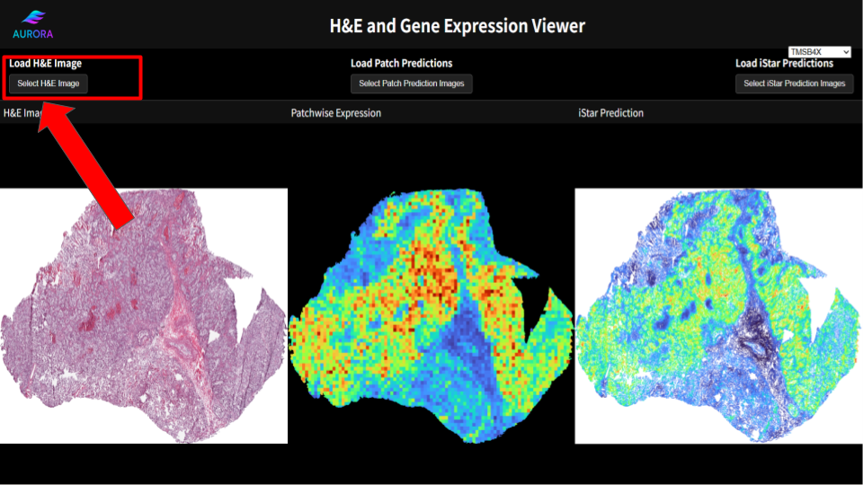
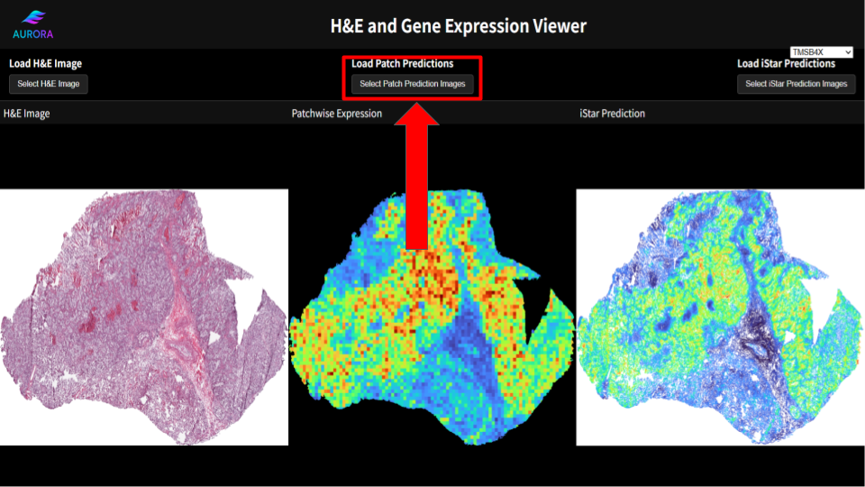
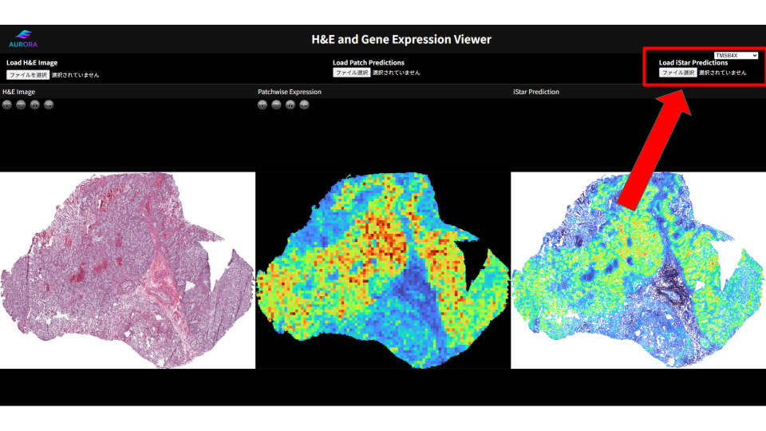
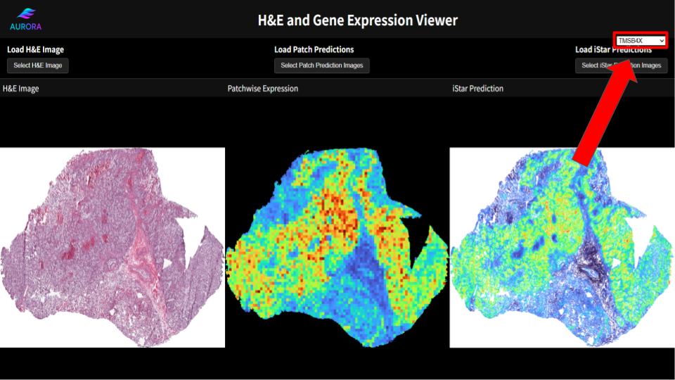

# AURORA H&E + Gene Expression Viewer
 
An interactive web-based viewer for visualizing H&E slide images alongside
patch-wise and iStar gene expression predictions.

## Input File:
You can download the following input files from [HuggingFace](https://huggingface.co/datasets/AURORAData/prediction_plots):

- **{name of dataset}.png** - The H&E image of the sample

- **{name of dataset}-{gene name}-patchwise-224.png** - Patch prediction of the gene in the sample

- **{name of dataset}-iStar-{gene name}.png** - Patch prediction of the gene in the sample

## Instructions:

### 1. Load H&E image to the website
- Load the H&E image sample by clicking the button under the text "Load H&E Image", then select the image of the sample.
  

### 2. Load Patch Predictions
- Load the patch predictions by clicking the button under the text "Load Patch Prediction", then inside the folder "patchwise_predictions", select the prediction plots. You can upload multiple samples by holding **control key** and click. You can upload all samples by pressing **control key + A** (Windows) or **command + A** (Mac).

### 3. Load iStar Predictions
- Load the iStar predictions by clicking the button under the text "Load iStar Prediction", then inside the folder "iStar_predictions", select the prediction plots. You can upload multiple samples by holding **control key** and click. You can upload all samples by pressing **control key + A** (Windows) or **command + A** (Mac).

### 4. Select the gene
- Select the gene of interest by clicking the dropdown above the text "Load iStar Prediction".

 
